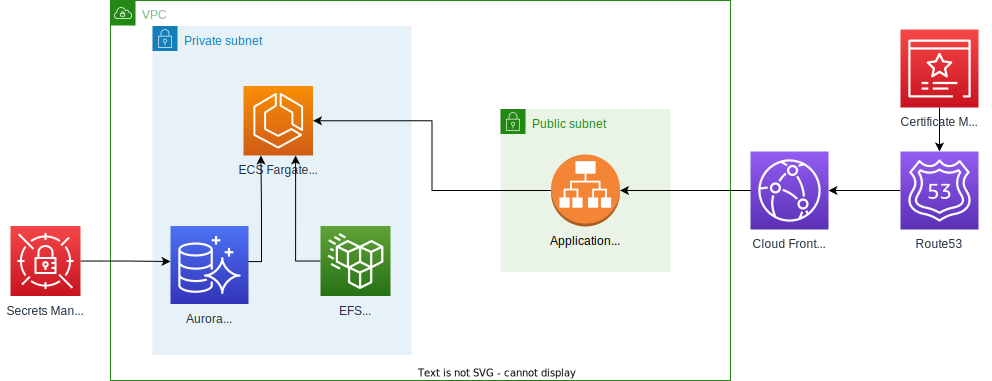

# WordPress Serverless 

## Description
This project provides a serverless solution for deploying a WordPress website using AWS services. The solution uses ECS with Fargate for deploying the WordPress website and RDS with Aurora Serverless for deploying the MySQL database required for the correct functioning of WordPress.

# Infrastructure
  

# Deployment

## Install Dependencies
To install all Python dependencies, run the following command:
```
pip install -r requirements.txt
```

## Configure Environment Variables
To deploy correctly, create a file named **.env** in the root directory of the project and configure the following properties as shown below:
```
AWS_ACCOUNT=<ACCOUNT_ID_FOR_TEST_ENVIRONMENT>
AWS_ACCOUNT_PROD=<ACCOUNT_ID_FOR_PROD_ENVIRONMENT>
AWS_REGION=<DESIRED_REGION_FOR_DEPLOY>
```
Note: Replace the values within <> with your own values.

## Configure the Context
Now, configure the context used during the deployment of the stack. In this case, it is used for storing some information needed for the deployment. Update the context value with the desired value in the file **cdk.context.json**:
```
 "dev": {
    "env": "dev",
    "project": <PROJECT_NAME>,
    "image": <WORDPRESS_IMAGE>
  },
  "prod": {
    "env": "prod",
    "project": <PROJECT_NAME>,
    "image": <WORDPRESS_IMAGE>
    "domain": <DOMAIN_NAME>
  }
```
Note:
- For the correct functioning of the deployment, the image must be publicly available, for example, on Docker Hub. In this case, **library/wordpress:latest** was used.
- The domain must be registered on the account where you want to deploy.

## Build CDK Stack
Now, build the stack using the following command:
```
cdk synth
```

## Deploy CDK Stack
Finally, proceed with the deployment using the following command:
```
cdk deploy <DESIRED_STACK>
```
Note: In this case, the stack can be either **WordpressServerlessStackDev** or **WordpressServerlessStackProd**.